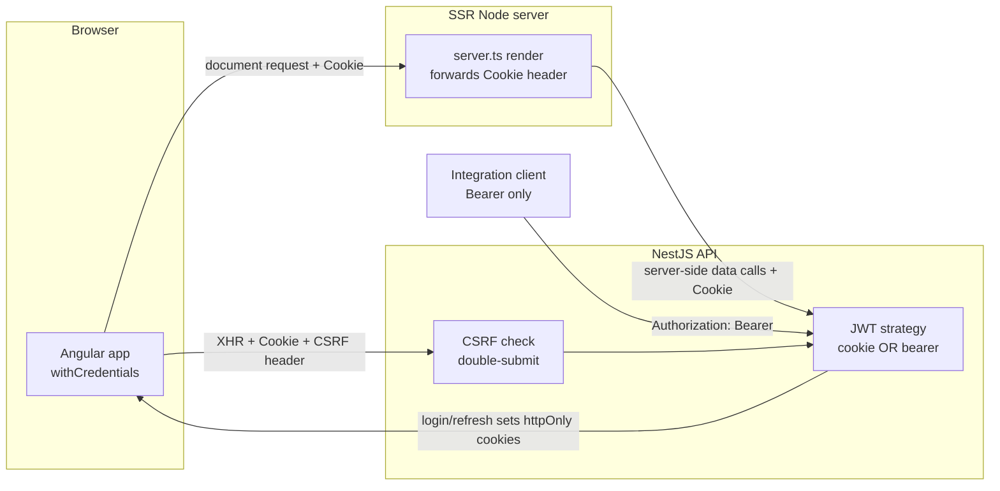
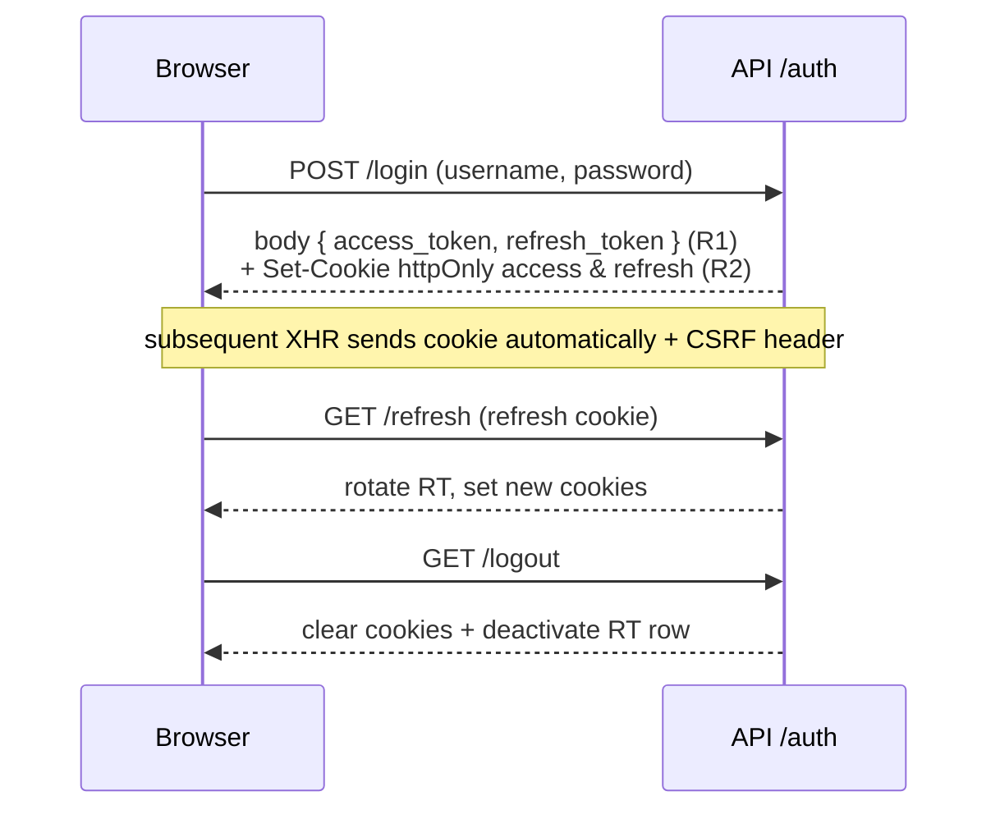

# Angular SSR + Dual-Transport Auth Migration - Plan

## Goal Capsule

**Objective.** Move `@hsm/web` from a client-side SPA to server-side rendering with `@angular/ssr`, gated on migrating the browser session from `localStorage` JWTs to an `httpOnly` cookie. Retire the runtime `config.json` machinery for server-read `process.env` + transfer state, and restructure Infisical secrets by consuming service.

**Authority hierarchy.** The origin brainstorm (`docs/brainstorms/2026-07-08-frontend-rendering-architecture-requirements.md`) is the decided WHAT; this plan is the HOW. Repo conventions (per-workspace `CLAUDE.md`) and the Oracle SELECT/UPDATE-only constraint override plan details on conflict. The API's existing Bearer token contract is **inviolable** — every auth change is additive.

**Stop conditions.** Surface a blocker rather than guessing when: an auth change would alter the existing Bearer response body or break integration clients; an SSR guard would require rewriting a feature rather than platform-guarding it; a Track-4 step needs a destructive Infisical operation. Track 4's live secret-store mutations are executed by a human operator, not autonomously.

**Execution profile.** Sequenced by track: Track 1 (auth) lands and is verified behind the **existing SPA** before Track 2 flips SSR on. Tracks 3 and 4 follow SSR. Each track is independently shippable.

---

## Product Contract

### Summary

Adopt `@angular/ssr` (keep Angular, no framework switch) so first paint renders on infra we control — the win for low-end hospital hardware — with incremental hydration deferring client JS. Because `localStorage` never rides the document request, SSR is gated on adding an `httpOnly` cookie transport for the browser session while retaining Bearer for integrations. Once the session is cookie-backed, retire `config.json` in favour of the SSR Node server reading `process.env` and passing non-secret config via Angular transfer state, and partition Infisical `/app` by consuming service.

### Problem Frame

While making `@hsm/web` config env-driven, the team built a runtime `config.json` (generated from env at container start, fetched at boot) plus an app-initializer. It worked but fought the platform: config, versioning, and compute all had to be shipped to a device the team does not control. Two facts turned the lean into a decision — hospital hardware is low-end (heavy lifting belongs on sizable infra, not the client), and one Docker image driven by runtime env is natural for a Node SSR process that reads `process.env` like the NestJS apps (no per-environment rebuild, unlike build-time `environment.ts` or `.env`-baking plugins that freeze the API URL into the bundle).

The gating constraint is auth: the app stores access + refresh JWTs in `localStorage` (`apps/frontend/web/src/app/core/auth/token-storage.ts`), and every route except `/login` is behind `authGuard`. `localStorage` is never attached to the document request, so an SSR server cannot know the user at render time — it would render anonymous and re-render after hydration (a login flash + throwaway server render on every page), making SSR worse than the current SPA. Moving the browser session to an `httpOnly` cookie that rides the document request is therefore the prerequisite for the other three tracks.

### Requirements

**Auth (Track 1 — prerequisite)**

- R1. `/auth/login` and `/auth/signup`/`/auth/onboarding` continue to return `{ access_token, refresh_token }` in the body unchanged (integrations / direct-API clients keep working).
- R2. The same login/signup/onboarding responses also set `httpOnly` access + refresh cookies. `/auth/refresh` reads and rotates the refresh cookie; `/auth/logout` clears both cookies.
- R3. Cookie attributes: `httpOnly`, `secure`, and `Domain` set to the **shared parent registrable domain** via `COOKIE_DOMAIN` (so the cookie is first-party to both the web and API subdomains and rides the SSR document request to the web origin). The web and API subdomain labels and the TLD are deployment config, not hardcoded — the only invariant is that both are subdomains of one shared parent. `SameSite=Lax` on the **access** cookie — it must accompany top-level document navigations (including external-referral entry) so SSR renders an authenticated first paint; `SameSite=Strict` on the **refresh** cookie, which is path-scoped to the refresh route. Access-cookie lifetime mirrors the current AT expiry (`15m` user), refresh-cookie mirrors the current RT expiry (`1d` user) and rotation semantics. Because a parent-domain cookie is shared with every subdomain of that parent, all subdomains under it must be trusted/controlled, and the double-submit CSRF token (R5) remains the guard against same-site abuse.
- R4. The JWT access strategy extracts the token from the `Authorization` bearer header **or** the access cookie; the refresh strategy extracts from the bearer header **or** the refresh cookie; `/auth/logout` accepts the token from either source.
- R5. CSRF protection on state-changing requests: `SameSite=Strict` plus a double-submit CSRF token required on mutations from the browser transport.
- R6. The frontend stops persisting tokens in `localStorage`; the HTTP layer sends the cookie automatically (`withCredentials`) instead of attaching a Bearer from JS. `restoreSession` and guards derive from the cookie-backed session.

**SSR (Track 2)**

- R7. `@angular/ssr` is enabled (Angular 21, zoneless SSR) with server routes and incremental hydration.
- R8. Browser-only code is platform-guarded so SSR bootstrap does not touch `window`/`document`/`localStorage`: Monaco, the Handlebars client preview, the `hsm.lang`/`hsm.lastUsername` reads, and the `bootLocaleId` provider-time `localStorage` read. The Transloco loader resolves an absolute URL server-side.
- R9. On server-side data calls the SSR server forwards the incoming cookie to the API; guards run server-side off the **access** cookie as a **read-only probe** — SSR never refreshes or rotates the RT. When the access cookie is absent/expired, SSR renders a neutral authenticated shell (not a hard login redirect) and the client performs the refresh immediately after hydration.
- R10. The web image entrypoint runs the SSR Node server instead of a static file server.

**Config (Track 3)**

- R11. The SSR server reads `process.env` and passes non-secret config to the client via transfer state; the boot `config.json` fetch, `scripts/gen-config.mjs`, and the config app-initializer are removed.
- R12. API base URL is **host only** (e.g. `http://localhost:4201`); the API version (`/v1`, `/v2`) is chosen per endpoint by the caller, not baked into the base.
- R13. UI version comes from a build-time file/endpoint (git SHA), symmetric with the API's `/v1/health/version` — not a `WEB_APP_VERSION` env var. `WEB_PRODUCTION` is dropped (the SW toggle uses `!isDevMode()`).

**Config ownership + Infisical (Track 4) — expanded after U1 (see `docs/solutions/tooling-decisions/config-ownership-and-settings-seed-belong-to-consumers.md`)**

- R14. Partition Infisical `/app` by **consuming package/module**, not by app — folders mirror ownership: `/shared` (only `ENVIRONMENT`), `/database` (`DB_POSTGRES_*`), `/queue`-or-redis (`DB_REDIS_*`), `/storage` (`STRG_S3_*`), `/api` (`JWT_*`, `COOKIE_*`, `APP_BASE_URL`, `SWAGGER_*`, `SMTP_WEBHOOK_KEY`, `DEFAULT_ADMIN_*`), `/worker` (`SMTP_*`), `/web` (`WEB_API_BASE_URL`, `WEB_PORT`, Track 3). One read-scoped machine identity per service; each service injects the folders whose vars its packages/app validate. dev/staging/prod remain the orthogonal Infisical *environment* axis, not folders.
- R15. **Invert config ownership in `@hsm/config`**: each package/app validates its own env slice via its own `envs` (Joi validation retained). `base` shrinks to `ENVIRONMENT`; `@hsm/database` owns `DB_POSTGRES_*`, `@hsm/queue` owns `DB_REDIS_*`, `@hsm/storage` owns `STRG_S3_*`, worker's coms/email owns `SMTP_*`, api owns `JWT_*`/`COOKIE_*`/`APP_BASE_URL`/`SWAGGER_*`/`SMTP_WEBHOOK_KEY`/`DEFAULT_ADMIN_*`. No service is forced to hold a var it does not consume.
- R16. **Invert the settings-seed system**: `@hsm/database` keeps only the settings table + `SettingsAccessor` (mechanism); each module registers its own seed-able settings from its own validated `envs`. Seeds are **insert-if-absent (never update)** and **idempotent** (`INSERT ... ON CONFLICT (key) DO NOTHING`) so N replicas converge without clobbering admin live-edits. Rename `COMS_WEBHOOK_SIGNING_KEYS` → `SMTP_WEBHOOK_KEY` across code + tests in lockstep.

### Scope Boundaries

- **In scope:** dual-transport auth, SSR enablement + platform guards, config-via-transfer-state, Infisical restructure — as sequenced tracks in one plan.
- **Not a framework switch.** Angular stays. Next.js/RSC is rejected (would rewrite the working zoneless Angular 21 + PrimeNG + Monaco + Transloco app and break Angular↔NestJS symmetry).
- **Not a thin-client rewrite.** SSR moves first render + enables deferred hydration; the app still runs client-side JS after hydration. Full server-only compute (HTMX-style) is out.

#### Deferred to Follow-Up Work

- Prerendering / static server routes for public pages (SSR is dynamic-render first).
- Server-side data-fetch resolvers for individual features beyond what R9 needs to render authenticated shells.
- Broader secret-reference cleanup in Infisical beyond the seven-folder partition (`/shared`, `/database`, `/queue`, `/storage`, `/api`, `/worker`, `/web`).

---

## Planning Contract

### Key Technical Decisions

- **KTD1 — Additive dual transport, not a replacement.** The API keeps returning tokens in the body (R1) and *also* sets cookies (R2). Passport strategies gain a second extractor (`ExtractJwt.fromExtractors([cookieExtractor, fromAuthHeaderAsBearerToken()])`) rather than swapping the bearer extractor out. Rationale: integration/direct-API clients must keep working untouched; the net security posture improves (httpOnly tokens are not XSS-stealable like the current localStorage tokens).

- **KTD2 — Set cookies via `@Res({ passthrough: true })`, mind the response envelope.** The controller returns token bodies directly today and a global `ResponseInterceptor` wraps responses. Setting cookies uses `passthrough: true` so the interceptor's envelope is preserved while `res.cookie(...)` runs. Verify the envelope shape is unchanged in `auth.controller.spec.ts`.

- **KTD3 — CSRF via hand-rolled double-submit token (default).** `SameSite=Strict` blocks cross-site cookie sends; a double-submit CSRF token (a non-httpOnly cookie mirrored into a request header on mutations) covers the residual case, framework-agnostic and dependency-light. `csurf` is deprecated; a maintained library (`csrf-csrf`) is the fallback if hand-rolling proves fragile. This is an Open Question flagged for confirmation during U3.

- **KTD4 — Rollout order: auth first, behind the existing SPA.** Track 1 lands and is verified against the current localStorage-free SPA before Track 2 enables SSR. Rationale: decouples the risky auth change from the SSR change; each is independently revertable. (Confirmed with the user over the lockstep alternative.)

- **KTD5 — Platform-guard, don't rewrite.** Browser-only sites (R8) are wrapped with `isPlatformBrowser` / `afterNextRender` / early `typeof window` returns — not re-architected. `afterNextRender`-based Monaco loading is already SSR-safe; the highest-risk site is `bootLocaleId()` reading `localStorage` at provider-construction time (`app.config.ts`), which runs during SSR bootstrap.

- **KTD6 — API base URL host-only; version per-endpoint.** `ApiClient.url()` currently prefixes with a base that already includes `/v1`. Split so the base is host-only and each call names its version segment, since the app may hit multiple API versions. Transfer state carries only the host.

- **KTD7 — Config via transfer state, keyed off the SSR server's `process.env`.** The SSR Node server reads env natively and injects non-secret config (host-only API base) into the render via Angular `TransferState`; `ConfigService` reads from transfer state instead of a fetched `config.json`. Same image, env at runtime, no rebuild per environment.

### Assumptions

- **Deployment is same-site (decided).** Web and API are served as two subdomains of a single shared registrable domain — `<web>.<domain>` and `<api>.<domain>` (subdomain labels and TLD are deployment config, not hardcoded; the invariant is the shared parent). Browser↔API requests are therefore same-site (different origin → CORS-with-credentials still required; `main.ts` already sets `credentials: true` / `origin: envs.APP_BASE_URL`). The session cookie is issued with `Domain` = the shared parent (`COOKIE_DOMAIN`) so it is first-party to both subdomains and rides the SSR document request. No BFF/proxy and no `SameSite=None` third-party-cookie exposure. Dev (`localhost:4200`/`:4201`) is same-site (`localhost`), so it faithfully represents the prod topology. Server-to-server SSR→API base URL may differ from the browser's base URL (Open Question).
- The refresh-cookie path scope (`/v1/auth/refresh` vs `/auth/refresh`) follows the API's URI versioning (`v1`). Confirm the exact path during U1.
- Transloco catalogs stay served from `public/i18n/{es,en}.json`; SSR resolves an absolute URL to them server-side.

### Sequencing

Track 1 (U1–U5) → Track 2 (U6–U9) → Track 3 (U10–U12) → Track 4 (U13→U14→U15). Within Track 1, backend (U1–U3) precedes frontend (U4–U5). Track 3's host-only refactor (U11) depends on SSR transfer state (U10) existing.

---

## High-Level Technical Design

Dual-transport request paths after Track 1, and where SSR forwards cookies after Track 2:

Auth token lifecycle (issuance is unchanged; cookie-setting and dual extraction are added):

---

## Implementation Units

### U1. Backend — cookie infrastructure + set cookies on auth responses

- **Goal:** Register `cookie-parser`, add cookie/CSRF config vars, and set `httpOnly` access + refresh cookies on login/signup/onboarding/refresh; clear them on logout. (R2, R3)
- **Requirements:** R2, R3, R1 (must not change the existing body).
- **Dependencies:** none.
- **Files:** `apps/backend/api/src/main.ts` (register `cookie-parser`), `apps/backend/api/src/modules/security/auth/auth.controller.ts` (`@Res({ passthrough: true })`, `res.cookie`/`res.clearCookie`), `apps/backend/api/src/modules/security/auth/auth.service.ts` (cookie-options helper), `packages/config/src/fields.ts` + `packages/config/src/api.ts` (new `COOKIE_*` group — secure flag, domain, refresh path), `apps/backend/api/src/test-setup.ts` (dummy values for new required vars), `package.json`/api deps (`cookie-parser`, `@types/cookie-parser`), `apps/backend/api/src/modules/security/auth/auth.controller.spec.ts` (test), `apps/backend/api/src/modules/security/auth/auth.service.spec.ts` (test).
- **Approach:** Keep `generateTokens()`/`login()` returning `ITokens` unchanged; add a helper that maps AT/RT to cookie options (attributes per R3, access lifetime = AT exp, refresh = RT exp, refresh path-scoped to the versioned refresh route). Set both cookies alongside the existing body via `passthrough` so the global `ResponseInterceptor` envelope is preserved (KTD2). Add `COOKIE_*` to `fields.ts` (single Joi source), the key list + interface in `api.ts`, and dummy values in `test-setup.ts` per the api `CLAUDE.md`. **`COOKIE_SECURE` must be pinned by a Joi cross-field rule (or a boot assertion): when `ENVIRONMENT` is `staging`/`prod`, `secure` must be `true` — a misconfigured `COOKIE_SECURE=false` in prod would emit the httpOnly session cookies over cleartext HTTP and must fail boot rather than silently downgrade.**
- **Patterns to follow:** existing `JWT_AT_*`/`JWT_RT_*` config grouping in `packages/config/src/fields.ts`; existing controller endpoint tests in `auth.controller.spec.ts`.
- **Test scenarios:**
  - Covers R1. `POST /auth/login` response body still equals `{ access_token, refresh_token }` and the `ResponseInterceptor` envelope is unchanged.
  - Covers R2/R3. Login sets `Set-Cookie` for access and refresh with `httpOnly`, `secure`, `SameSite=Strict`; refresh cookie carries the refresh route path.
  - Signup and onboarding responses set the same cookies.
  - `/auth/logout` emits `clearCookie` for both.
  - Config: omitting a new `COOKIE_*` required var fails validation; `test-setup.ts` provides dummies so the suite still boots.
- **Verification:** `pnpm --filter @hsm/api test` green; manual `curl -i` on login shows both `Set-Cookie` headers and the unchanged body.

### U2. Backend — dual extraction in JWT strategies + logout cookie fallback

- **Goal:** Access and refresh Passport strategies read the token from the bearer header **or** the corresponding cookie; `/auth/logout` and the RT strategy's manual re-extraction gain a cookie fallback. (R4)
- **Requirements:** R4.
- **Dependencies:** U1.
- **Files:** `apps/backend/api/src/modules/security/auth/auth.strategy.ts` (`ExtractJwt.fromExtractors`, cookie extractor for `jwt-at` and `jwt-rt`; RT `validate()` cookie fallback), `apps/backend/api/src/modules/security/auth/auth.controller.ts` (logout reads token from cookie when the `Authorization` header is absent), a small cookie-extractor util (e.g. `apps/backend/api/src/modules/security/auth/cookie-extractor.ts`), strategy/guard spec coverage under `apps/backend/api/src/modules/security/auth/` and `apps/backend/api/src/modules/security/roles/`.
- **Approach:** Replace `fromAuthHeaderAsBearerToken()` with `fromExtractors([cookieExtractor, fromAuthHeaderAsBearerToken()])` in both strategies so bearer clients are unaffected and cookie clients resolve. In `AuthJwtRTStrategy.validate()` the raw RT is currently re-read from the `Authorization` header — add a cookie fallback so rotation works cookie-only. `logout` reads the token from `req.cookies` when no bearer header is present. **In the same edit, remove/redact the raw refresh token from `AuthJwtRTStrategy.validate()`'s `logger.debug('jwt-rt strategy validate user:', refreshUser)` call — `refreshUser` carries the 1d RT, and a plaintext token in logs is a replayable long-lived credential. Log a subject id only, never the token.**
- **Patterns to follow:** existing strategy definitions in `auth.strategy.ts`; existing guard specs.
- **Test scenarios:**
  - Covers R4. A request with only the access cookie (no bearer) authenticates through `jwt-at`.
  - A request with only a bearer (no cookie) still authenticates (integration path unbroken).
  - Refresh with only the refresh cookie rotates the RT (`validate()` picks up the cookie value).
  - Logout with only the cookie deactivates the active RT row.
  - A request with neither cookie nor bearer is rejected.
- **Verification:** `pnpm --filter @hsm/api test` green; both transports proven in one spec.

### U3. Backend — CSRF double-submit protection on mutations

- **Goal:** Require a double-submit CSRF token on state-changing browser requests without breaking bearer integration clients. (R5)
- **Requirements:** R5.
- **Dependencies:** U1.
- **Files:** `apps/backend/api/src/main.ts` (CSRF middleware wiring), a CSRF guard/middleware (e.g. `apps/backend/api/src/modules/security/csrf/`), `packages/config/src/fields.ts` + `api.ts` (`CSRF_*` if a secret is needed), `apps/backend/api/src/test-setup.ts`, spec for the CSRF guard, `apps/backend/api/test/` e2e if the mutation path warrants it.
- **Approach:** Issue a non-httpOnly CSRF cookie on session start; require its value echoed in a request header on mutating methods. Enforce only when the request authenticates via cookie (bearer/integration requests are exempt — they cannot be CSRF'd). **Confirm hand-rolled vs. `csrf-csrf` at the start of this unit** (KTD3 / Open Question); if hand-rolling is fragile for the Express layer, adopt the library. **Security invariant (non-negotiable): the token must be integrity-bound to the session — an HMAC over the session/user identity verified server-side, NOT a raw `cookie == header` equality check.** A plain double-submit is forgeable whenever an attacker can plant a cookie (sibling subdomain, MITM on an http subdomain), since they then control both halves. "Hand-rolled" therefore means *signed* double-submit; with the invariant fixed, hand-rolled-vs-`csrf-csrf` is a genuinely ergonomic choice. **The CSRF cookie itself is `Secure`, `SameSite` matching the auth cookies, and non-httpOnly by design (JS must read it); it shares the same prod-`Secure` guard as the auth cookies.**
- **Execution note:** Start with a failing test asserting a cookie-authenticated POST without the CSRF header is rejected, then implement to green.
- **Test scenarios:**
  - Covers R5. Cookie-authenticated mutation without a matching CSRF header → rejected.
  - Cookie-authenticated mutation with a matching CSRF header → allowed.
  - Bearer-authenticated mutation without a CSRF header → allowed (integration exemption).
  - Safe methods (GET) are never blocked.
- **Verification:** `pnpm --filter @hsm/api test` + relevant e2e green.

### U4. Frontend — drop localStorage tokens; cookie-based HTTP + CSRF header

- **Goal:** Remove `TokenStorage`/localStorage token handling; send the cookie via `withCredentials` and attach the CSRF header on mutations; derive session from the cookie. (R6)
- **Requirements:** R6.
- **Dependencies:** U1, U2, U3.
- **Files:** `apps/frontend/web/src/app/core/auth/token-storage.ts` (remove or reduce to non-token use), `apps/frontend/web/src/app/core/auth/auth.interceptor.ts` (drop bearer-attach + manual bearer-refresh; set `withCredentials`, attach CSRF header, on 401 call cookie refresh), `apps/frontend/web/src/app/core/auth/auth.service.ts` (`restoreSession`/`hasToken` derive from a profile probe, not a stored token), `apps/frontend/web/src/app/core/api/api-client.ts` (`withCredentials`), auth spec files under `apps/frontend/web/src/app/core/auth/`.
- **Approach:** The cookie is sent automatically once `withCredentials` is set, so the interceptor no longer reads a token from JS. `restoreSession()` changes from "if `hasToken()` then `loadProfile()`" to attempting `loadProfile()` and treating 401 as anonymous. Refresh-on-401 calls the cookie refresh endpoint; the queued-refresh machinery can stay but no longer carries a bearer.
- **Patterns to follow:** existing functional `HttpInterceptorFn` structure in `auth.interceptor.ts`; existing `AuthService` signal-based state.
- **Test scenarios:**
  - Covers R6. Outgoing requests carry `withCredentials` and no `Authorization` header from JS.
  - Mutations attach the CSRF header from the CSRF cookie.
  - `restoreSession()` with a valid cookie loads the profile; with none, resolves anonymous without error.
  - A 401 triggers a single cookie-refresh and retries the queued requests.
- **Verification:** `pnpm --filter @hsm/web test` green; manual login in the SPA works with no tokens in `localStorage`.

### U5. Frontend — login/logout flow cleanup

- **Goal:** Update login/logout/register/onboarding to the cookie model and remove now-dead token plumbing. (R6)
- **Requirements:** R6.
- **Dependencies:** U4.
- **Files:** `apps/frontend/web/src/app/features/auth/login/login.ts`, `apps/frontend/web/src/app/features/auth/register/register.ts`, `apps/frontend/web/src/app/features/onboarding/onboarding.ts`, `apps/frontend/web/src/app/app.config.ts` (the `restoreSession` app-initializer still runs, now cookie-derived), related feature specs.
- **Approach:** `auth.login()`/`signup()`/`onboarding()` no longer `save(tokens)` to storage; they just `loadProfile()` (the cookie is already set by the response). Keep the `hsm.lastUsername` convenience read (it moves under a platform guard in U7). Logout stays `GET /auth/logout` (now clears cookies server-side).
- **Test scenarios:**
  - Login navigates to `returnUrl` and populates `currentUser` from the profile, no token persisted.
  - Logout clears `currentUser` and the server clears cookies.
  - Register + onboarding complete without touching token storage.
- **Verification:** `pnpm --filter @hsm/web test` green; end-to-end login/logout in the SPA.

### U6. SSR — enable `@angular/ssr` and the server entry

- **Goal:** Add `@angular/ssr` with a server bootstrap, server routes, and incremental hydration; wire the builder. (R7)
- **Requirements:** R7.
- **Dependencies:** U5 (auth cookie-backed so SSR renders authenticated).
- **Files:** `apps/frontend/web/package.json` (`@angular/ssr`, `@angular/platform-server`, `express`), `apps/frontend/web/angular.json` (server/ssr/outputMode options), `apps/frontend/web/src/main.server.ts`, `apps/frontend/web/src/server.ts`, `apps/frontend/web/src/app/app.config.server.ts` (`provideServerRendering`), `apps/frontend/web/src/app/app.config.ts` (`provideClientHydration` with incremental hydration).
- **Approach:** Follow Angular 21 first-party SSR scaffolding for a zoneless app. Add server routes and incremental hydration to defer client JS. This unit only stands SSR up; browser-only guards land in U7 and cookie forwarding in U8.
- **Execution note:** Mostly scaffolding/config; prefer a build + SSR runtime smoke check (`ng build`, run the server, curl a rendered route) over unit coverage.
- **Test scenarios:** `Test expectation: none -- scaffolding/config; proven by the build + SSR smoke verification below.`
- **Verification:** `pnpm --filter @hsm/web build` produces a server bundle; running the SSR server returns server-rendered HTML for a public route.

### U7. SSR — platform-guard browser-only code

- **Goal:** Guard every browser-only site so SSR bootstrap never touches `window`/`document`/`localStorage`, and the Transloco loader resolves an absolute URL server-side. (R8)
- **Requirements:** R8.
- **Dependencies:** U6.
- **Files:** `apps/frontend/web/src/app/app.config.ts` (`bootLocaleId()` localStorage read — highest risk), `apps/frontend/web/src/app/core/i18n/language.service.ts` (`hsm.lang`), `apps/frontend/web/src/app/features/auth/login/login.ts` (`hsm.lastUsername`), `apps/frontend/web/src/app/core/i18n/transloco-loader.ts` (absolute URL server-side), `apps/frontend/web/src/app/features/templates/monaco-editor.ts` + `apps/frontend/web/src/app/core/editor/monaco-setup.ts` (confirm guards under SSR), `apps/frontend/web/src/app/features/templates/template-preview.util.ts` + `template-editor.ts` (Handlebars/`Blob`/`URL.createObjectURL`), `apps/frontend/web/src/app/core/pwa/*` (already `isEnabled`/window-guarded — verify), `apps/frontend/web/src/app/features/documents/documents.ts` (`document.createElement('a')` download).
- **Approach:** Wrap provider-time reads with `isPlatformBrowser(inject(PLATFORM_ID))`; wrap component-time browser work in `afterNextRender`. Monaco's `afterNextRender` lazy import is already SSR-safe — confirm. The Transloco `HttpClient.get('/i18n/..')` needs an absolute base under SSR (inject a server base or resolve from the request origin).
- **Test scenarios:**
  - Covers R8. `bootLocaleId()` returns a safe default under a server platform (no `localStorage` access).
  - Language service read/write is a no-op server-side and functional in the browser.
  - Transloco loader fetches `en`/`es` catalogs under SSR via an absolute URL.
  - Monaco/Handlebars preview do not execute during server render.
- **Verification:** SSR render of an authenticated route produces no `window is not defined`/`localStorage is not defined` errors; `pnpm --filter @hsm/web test` green.

### U8. SSR — forward cookies to the API on server-side calls

- **Goal:** On server-side data calls the SSR server forwards the incoming request's cookie to the API; guards run server-side off the access cookie as a read-only probe (SSR does not refresh/rotate). (R9)
- **Requirements:** R9.
- **Dependencies:** U7, U2.
- **Files:** `apps/frontend/web/src/server.ts` (capture the request), an SSR request-context provider + an HTTP interceptor branch that, when running server-side, attaches the forwarded `Cookie` header (`apps/frontend/web/src/app/core/auth/auth.interceptor.ts` or a new server interceptor), `apps/frontend/web/src/app/app.config.server.ts` (provide the request token).
- **Approach:** Provide the incoming `Cookie` header via an injection token available only in the server config; the HTTP layer attaches it to outbound API calls during server render so the API's cookie extractor (U2) authenticates the SSR render. **SSR is a read-only session probe: it renders off the access cookie only and never refreshes or rotates the RT server-side (model (a), decided 2026-07-10). When the access cookie is absent/expired, SSR renders a neutral authenticated shell — not a hard login redirect — and the client performs the refresh immediately after hydration.** This keeps the refresh token scoped to `/v1/auth` (no `path=/` broadening) and avoids re-emitting a rotated `Set-Cookie` from the document response. **Isolation invariant (non-negotiable): the inbound `Cookie` must be bound to a request-scoped injection token — never a shared/singleton provider or module-level variable — because the long-lived SSR Node process serves many users' requests concurrently, and a shared provider would bleed one user's session cookie into another render's outbound calls or HTML (cross-account exposure). Add a test asserting two concurrent renders with different session cookies never cross outbound `Cookie` headers, and constrain the SSR→API base URL to a trusted internal host (do not forward httpOnly tokens to an untrusted origin; see Open Questions).**
- **Test scenarios:**
  - Covers R9. During server render, outbound API calls carry the forwarded `Cookie` header.
  - A valid session cookie renders the authenticated shell server-side (no post-hydration login flash).
  - A missing/expired access cookie renders a neutral authenticated shell server-side (no hard login redirect); the client refreshes after hydration. SSR never rotates the RT.
- **Verification:** curl with a valid session cookie against the SSR server returns the authenticated shell in the initial HTML.

### U9. SSR — web image runs the Node server

- **Goal:** Replace the static `serve -s dist` runtime with the SSR Node server. (R10)
- **Requirements:** R10.
- **Dependencies:** U8.
- **Files:** `apps/frontend/web/Dockerfile` (runtime stage runs the SSR server), `docker/docker-compose.yaml` (web command/entry if referenced), `apps/frontend/web/package.json` (`serve:ssr`/start script).
- **Approach:** Runtime stage runs `node dist/server/server.mjs` (or the emitted server entry) on the existing web port; drop the `gen-config.mjs` invocation here in Track 3 (U12). Keep `EXPOSE` and port mapping consistent with the port map.
- **Execution note:** Config/packaging; verify by running the image and hitting a rendered route.
- **Test scenarios:** `Test expectation: none -- image/runtime config; proven by the container smoke check.`
- **Verification:** the built web image serves server-rendered HTML on its port.

### U10. Config — transfer-state config from the SSR server's env

- **Goal:** The SSR server reads `process.env` and injects non-secret config via Angular transfer state; `ConfigService` reads from transfer state. (R11)
- **Requirements:** R11.
- **Dependencies:** U8.
- **Files:** `apps/frontend/web/src/server.ts` (read env, seed a config value), `apps/frontend/web/src/app/app.config.server.ts` (provide config into `TransferState`), `apps/frontend/web/src/app/core/config/config.service.ts` (read from `TransferState`), `apps/frontend/web/src/app/core/config/config.schema.ts` (validate the transferred shape), `apps/frontend/web/src/app/core/config/config-testing.ts` (test seam).
- **Approach:** On the server, read the host-only API base from `process.env` (e.g. `WEB_API_BASE_URL`), put it in `TransferState`; the browser reads it back during hydration. `ConfigService` keeps its getter surface but sources from transfer state — no boot fetch. The config app-initializer removal happens in U12.
- **Test scenarios:**
  - Covers R11. `ConfigService.apiBaseUrl` resolves from `TransferState` with no network fetch.
  - Missing/invalid transferred config fails validation loudly.
  - The test seam (`provideTestConfig`) still supplies a base for unit tests.
- **Verification:** rendered HTML embeds the transfer-state config block; the browser reads the host without fetching `config.json`.

### U11. Config — host-only API base, version per-endpoint

- **Goal:** Split the API base into host-only, with each call naming its version segment; UI version from a build-time file. (R12, R13)
- **Requirements:** R12, R13.
- **Dependencies:** U10.
- **Files:** `apps/frontend/web/src/app/core/api/api-client.ts` (`url()` builds `${host}/${version}/...`), all `ApiClient` callers that assumed `/v1` in the base (auth endpoints in `auth.service.ts`, `auth.interceptor.ts`, feature API calls), `apps/frontend/web/src/app/core/version/version.service.ts` (read a build-time version file/`version.json` instead of `appVersion` env), a build step emitting the git-SHA version file.
- **Approach:** `ApiClient.url(version, path)` (or a per-call version arg) so `/v1`, `/v2` are chosen per endpoint (KTD6). The transferred base is host-only. `VersionService.uiVersion` reads a build-time file symmetric to the API's `/v1/health/version`.
- **Test scenarios:**
  - Covers R12. `ApiClient.url()` composes host + explicit version; two different versions produce two different URLs from one base.
  - Auth endpoints resolve to `/v1/auth/...` after the split.
  - Covers R13. `VersionService.uiVersion` returns the build-time SHA, not an env value.
- **Verification:** `pnpm --filter @hsm/web test` green; API calls hit correct versioned URLs against a host-only base.

### U12. Config — remove config.json machinery; drop WEB_PRODUCTION

- **Goal:** Delete `config.json` generation/fetch and the config app-initializer; drop `WEB_PRODUCTION`. (R11, R13)
- **Requirements:** R11, R13.
- **Dependencies:** U10, U11.
- **Files:** remove `apps/frontend/web/scripts/gen-config.mjs`, `apps/frontend/web/public/config.json.example`; `apps/frontend/web/src/app/app.config.ts` (remove the config-fetch `provideAppInitializer`); `apps/frontend/web/package.json` (remove `predev`/`gen-config` scripts); `apps/frontend/web/Dockerfile` (remove the `gen-config.mjs` runtime call — already partly handled in U9); `apps/frontend/web/angular.json` and SW toggle sites using `WEB_PRODUCTION` → `!isDevMode()`.
- **Approach:** With transfer state in place (U10), the boot fetch is dead. Remove it and the generator; confirm the SW registration uses `!isDevMode()` (per the brainstorm the SW toggle already does).
- **Test scenarios:**
  - App boots with no `config.json` fetch and no missing-config error.
  - No remaining references to `WEB_PRODUCTION` or `gen-config`.
- **Verification:** `rg` finds no `config.json`/`gen-config`/`WEB_PRODUCTION` references; app boots via transfer state only.

### U13. Config — invert `@hsm/config` to package/app-owned validation

- **Goal:** Move env validation from a central `base` to the consuming package/app; `base` shrinks to `ENVIRONMENT`. (R15)
- **Requirements:** R15.
- **Dependencies:** none in Track 4 (can land independently; do after Track 1 to avoid churn on shared config mid-auth). Note U1 added `COOKIE_*` to `api.ts` — those stay api-owned.
- **Files:** `packages/config/src/fields.ts` (keep the Joi rules; may split per-owner), `packages/config/src/base.ts` (reduce to `ENVIRONMENT`), `packages/config/src/api.ts` (owns `JWT_*`, `COOKIE_*`, `APP_BASE_URL`, `SWAGGER_*`, `SMTP_WEBHOOK_KEY`, `DEFAULT_ADMIN_*`), `packages/config/src/worker.ts` (owns `SMTP_*`), new per-package config surfaces for `@hsm/database` (`DB_POSTGRES_*`), `@hsm/queue` (`DB_REDIS_*`), `@hsm/storage` (`STRG_S3_*`), plus every `envs` import site that must repoint to the new owner. `apps/backend/api/src/test-setup.ts` + `apps/backend/worker/src/test-setup.ts`.
- **Approach:** Each package exports a validated `envs` for its own slice; the shared packages stop importing `base` for vars they own. Retain Joi validation everywhere (no raw `process.env`). Guard against DI/boot regressions — a moved var that a package no longer validates but still reads will fail at runtime, so `start:dev` both api and worker.
- **Execution note:** Cross-cutting. Do **not** rely on `start:dev` alone to catch a misplaced var — Joi only validates the keys a package *declares*, so a var removed from a package's slice but still read via `envs.X` throws only when that code path runs, and several owned vars are lazily read (`SMTP_*` on send, `APP_BASE_URL` in `account-recovery` on password reset, the webhook key on inbound webhook) so a clean boot proves nothing. **Statically characterize every `envs.<VAR>` read site (grep each var) and assert its owning package still declares that key** (the companion doc already did this grep for the base set); add coverage for the lazily-read paths. Boot **both** api and worker (`start:dev`) after as a secondary check.
- **Test scenarios:**
  - Covers R15. `@hsm/api` boots validating only its owned vars + the packages it imports; omitting a worker-only var (SMTP) does **not** break api boot.
  - `@hsm/worker` boots without api-only vars (JWT/COOKIE/SWAGGER) present.
  - Each package's `envs` throws when its own required var is missing.
- **Verification:** both apps `start:dev` cleanly with least-privilege env sets; existing api/worker test suites stay green.

### U14. Settings — invert seed ownership + idempotent insert-only seeding

- **Goal:** `@hsm/database` keeps only the settings table + accessor; each module registers/seeds its own settings from its own `envs`; seeds are insert-if-absent + idempotent. Rename `COMS_WEBHOOK_SIGNING_KEYS` → `SMTP_WEBHOOK_KEY`. (R16)
- **Requirements:** R16.
- **Dependencies:** U13.
- **Files:** `packages/database/src/settings/setting-definitions.ts` (remove env reads/catalog; keep only the mechanism seam), `packages/database/src/settings/settings-accessor.service.ts`, a registration API so modules contribute seed-able settings, the api coms/webhook module + worker coms/email module (register their own seeds from their `envs`), `getWebhookSigningKeys` consumers, both `test-setup.ts`, `packages/common` settings DTOs if the key name is surfaced.
- **Approach:** Provide a settings-registration seam; each owning module registers `{ key, envValue }` from its validated `envs`. Seeding uses `INSERT ... ON CONFLICT (key) DO NOTHING` (insert-only, never update) so N replicas converge without clobbering admin live-edits. Rename the webhook key everywhere it is read in lockstep with the env var.
- **Execution note:** Data-safety sensitive — add a test proving a re-seed does **not** overwrite an existing (admin-edited) setting value.
- **Test scenarios:**
  - Covers R16. Re-running seed on an existing key is a no-op (admin value preserved).
  - Concurrent/duplicate seed of the same key inserts once.
  - `SMTP_WEBHOOK_KEY` resolves through `getWebhookSigningKeys()` after the rename (old name no longer referenced).
  - A module's seed reads from its own `envs`, not `@hsm/database`.
- **Verification:** api/worker boot + seed idempotently; webhook verification still works under the new key name; suites green.

### U15. Infisical — partition /app by consuming package/module (operator-executed)

- **Goal:** Restructure Infisical `/app` into per-owner folders with per-service machine identities, matching the U13/U14 ownership. (R14)
- **Requirements:** R14.
- **Dependencies:** U13, U14 (folders mirror the code ownership those units establish); U9/U10 for `/web`.
- **Files:** `.devcontainer/script/get-secrets-infisical.sh` (fetch the owner folders each service needs), compose/env wiring, the layout doc under `docs/solutions/`. **Live secret-store mutations are performed by a human operator, not `ce-work`.**
- **Approach:** Folders mirror ownership: `/shared` (`ENVIRONMENT`), `/database`, `/queue` (redis), `/storage`, `/api`, `/worker`, `/web`. Each service injects only the folders whose vars its packages/app validate (api: shared+database+queue+storage+api; worker: shared+database+queue+storage+worker; web: shared+web). One read-scoped machine identity per service; dev/staging/prod stay the environment axis.
- **Execution note:** Ops/config; the plan documents the target layout + fetch-script wiring; a human applies the Infisical-side changes.
- **Test scenarios:** `Test expectation: none -- secret-store change; verified by each service booting with only its owner folders.`
- **Verification:** api/worker/web each boot reading only their owner folders; `get-secrets-infisical.sh` produces the expected per-service `.env`.

---

## Verification Contract

- **Backend:** `pnpm --filter @hsm/api test` (Jest, colocated specs), `pnpm --filter @hsm/api test:e2e` for the CSRF/auth request paths. Baseline auth suite must stay green; new cookie/CSRF/dual-extraction assertions added per unit. New required config vars need dummies in `apps/backend/api/src/test-setup.ts` or the suite fails to boot.
- **Frontend:** `pnpm --filter @hsm/web test` (Vitest). SSR is proven by runtime smoke checks, not unit tests: `pnpm --filter @hsm/web build` emits a server bundle, and the running SSR server returns server-rendered HTML — anonymous route (U6), authenticated shell via forwarded cookie (U8), no `window/localStorage is not defined` errors (U7).
- **Lint/format:** `pnpm lint` (and `pnpm check:fix`) across touched workspaces.
- **Manual gates:** login/logout in the SPA with zero tokens in `localStorage` (Track 1); server-rendered authenticated first paint with no login flash (Track 2); app boot with no `config.json` fetch (Track 3); per-service Infisical fetch (Track 4).

---

## Definition of Done

- **Global.** All four tracks land dependency-ordered; the existing Bearer contract is byte-for-byte unchanged (R1) and integration clients are proven working alongside cookie clients. Every referenced requirement (R1–R16) is satisfied or explicitly deferred. Abandoned/experimental code from the SSR spike is removed from the diff. `pnpm lint` and the per-workspace test suites are green.
- **Track 1 (U1–U5).** Dual transport works both ways; CSRF blocks cookie mutations lacking the token and exempts bearer clients; the SPA runs with no `localStorage` tokens.
- **Track 2 (U6–U9).** SSR renders the authenticated shell server-side using the forwarded cookie; no browser-only code executes during server render; the web image runs the SSR Node server.
- **Track 3 (U10–U12).** Config comes from transfer state off `process.env`; API base is host-only with per-endpoint versions; `config.json`, `gen-config.mjs`, the config app-initializer, and `WEB_PRODUCTION` are gone; UI version is the build-time SHA.
- **Track 4 (U13–U15).** `@hsm/config` validation is package/app-owned (`base` = `ENVIRONMENT` only); the settings system seeds insert-only + idempotently from each module's own `envs` with `COMS_WEBHOOK_SIGNING_KEYS` renamed to `SMTP_WEBHOOK_KEY`; Infisical `/app` is partitioned by consuming package/module with per-service identities. Both apps boot with least-privilege env sets. Live secret-store changes applied by a human operator.

---

## Open Questions

- **CSRF mechanism (U3):** confirm hand-rolled double-submit vs. adopting `csrf-csrf` once the Express integration is prototyped. (Non-blocking; default is hand-rolled per KTD3.)
- **SSR↔API base URL:** the server-to-server base URL in the dev container and compose may differ from the browser's base URL — resolve during U8/U10.
- **Refresh-cookie path scope:** exact path (`/v1/auth/refresh`) confirmed against URI versioning during U1.
- **Deploy topology:** SSR Node server sizing and the UI health/version endpoint shape — resolve before the web image ships (U9).

### Raised by 2026-07-10 doc review — resolve before U1 / U8

- **[P0 — RESOLVED] SameSite posture + deployment topology.** Deployment is **same-site**: web and API run as two subdomains of one shared registrable parent domain (`<web>.<domain>` + `<api>.<domain>`; subdomain labels and TLD are deployment config via `COOKIE_DOMAIN`, not hardcoded — the invariant is the shared parent). Session cookie is issued with `Domain` = the shared parent (first-party to both subdomains, rides the SSR document request); access cookie `SameSite=Lax`, refresh cookie `SameSite=Strict` (see R3). No BFF, no `SameSite=None`, no third-party-cookie exposure. **F2** dissolves (access cookie is `Lax`, so external-referral top-level navigation renders authenticated). **S4** is bounded: the parent-domain cookie is required for SSR and is acceptable *given all subdomains of that parent are controlled* — R3 records this trust assumption and the CSRF double-submit (R5) remains the same-site guard; still decide login-CSRF handling for the pre-session `/auth/login` POST during U3. **A2** dissolves: dev (`localhost`) is same-site like prod, so the Track 1 SPA gate faithfully exercises the real cookie topology.
- **[P0 — RESOLVED] SSR-time refresh strategy (U8 / R9 / F1 + A3).** Model **(a) read-only probe** chosen. SSR renders off the access cookie only and never refreshes or rotates the RT server-side; on absent/expired access cookie it renders a neutral authenticated shell (not a hard login redirect) and the client refreshes after hydration. This sidesteps both defects — the path-scoped refresh cookie (F1) never needs to reach SSR, and there is no server-side rotation whose `Set-Cookie` could be lost (A3). Refresh token stays scoped to `/v1/auth`. R9/U8 updated; U8 test pins the neutral-shell + no-rotation behavior.
- **[P2] Track 4 scope/independence (SC1 + SC4).** The Goal Capsule claims "each track is independently shippable," but U15 depends on U9/U10 (`/web` folder) and the companion doc describes the config-ownership + settings-seed inversion as "its own cross-cutting refactor beyond the SSR plan." **Decide:** either extract Track 4 (U13–U15) into a standalone plan referenced by this one (keeping this plan scoped to Tracks 1–3), or keep it bundled but drop the "independently shippable" framing for Track 4 and qualify the Goal Capsule (Tracks 1–3 independent; Track 4 depends on Track 2/3 for `/web`).
