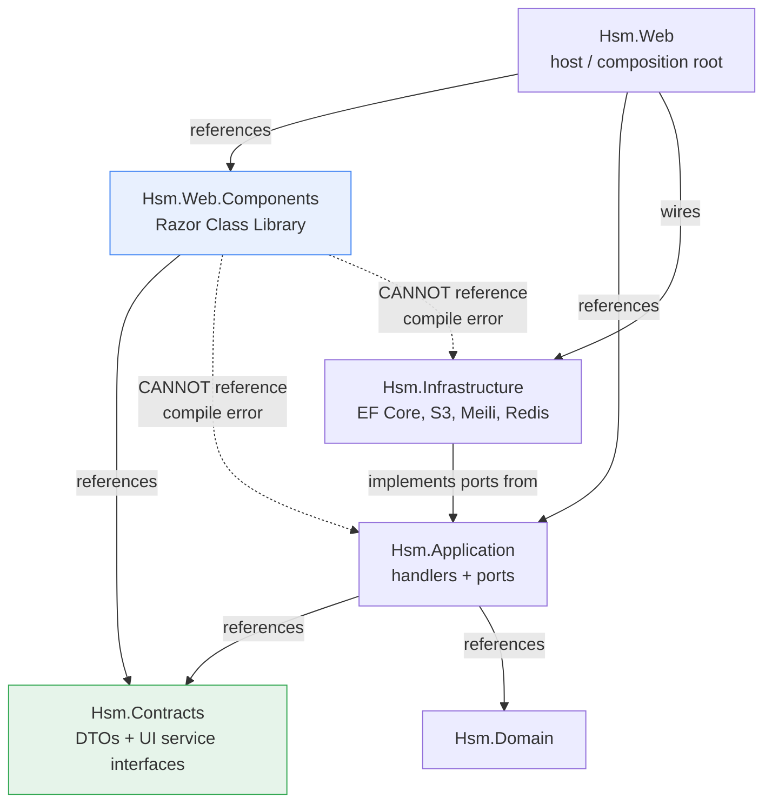
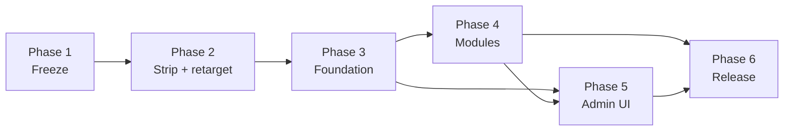

# .NET / Blazor rewrite — freeze, strip, rebuild the minor release

## Summary

Land and tag the TypeScript work, cut an anchor branch, strip the Node stack, retarget CI and the
dev toolchain to .NET, then stand up an ASP.NET Core solution whose UI library can only see shared
contracts — and rebuild the minor release on it: the legacy microservices' contract, auth parity,
documents, and a thin Blazor admin UI.

---

## Problem Frame

The TypeScript monorepo is being abandoned for .NET 10 / ASP.NET Core / EF Core / Blazor Server.
The full motivation, team situation, and management case live in the origin document; the short
version is that a solo developer needs a production release convincing enough to fund porting ~40
modules, and the destination stack has to be right before that funding arrives rather than after.

What makes this plan more than a rewrite is that the repository's entire toolchain assumes Node:
CI installs with pnpm and gates every protected branch on a single status check, the devcontainer
image is Node-based with an Oracle client baked in, the compose file defines Node application
services, and the root agent-instruction file routes to eight per-workspace files that the removal
deletes. Removing the source without retargeting those leaves a repository that cannot build,
cannot merge, and misdirects every future session.

---

## Requirements

Traced to the origin document's R-IDs.

**Freeze and branch model**
- R1. Current working state committed to `feat/ssr-auth-migration`.
- R2. That branch merged into `development` and the merge tagged as the frozen reference spec.
- R3. Anchor branch created from `development`; all rewrite branches fork from it.
- R4. Anchor merges to `development` only once the minor meets its definition of done.

**Repository cleanup**
- R5. Anchor's first commit removes the Node/TypeScript stack, explicitly and reviewably.
- R6. `docs/` retained; `docker/` and `.devcontainer/` retained and retargeted.

**Rebuild**
- R7. The .NET solution is the sole active codebase.
- R8. Frozen TypeScript is a reference specification, not transliteration source.
- R9. Client-isolation boundary established before the first module; on the critical path.

**Minor release**
- R10. Reproduces the six legacy microservices' external contract.
- R11. Auth and user handling at behavioral parity with the frozen monolith.
- R12. Documents capability with blob-backed storage, versioning, presigned access.
- R13. Thin Blazor Server admin UI — sign-in, users and roles, integration accounts and tokens,
  settings, document management.
- R14. Written definition of done fixed before rebuild work starts.
- R15. PostgreSQL only; no runtime Oracle connection.

**Document maintenance**
- R16. `docs/ARCHITECTURE-DECISIONS.md` amended.
- R17. `docs/brainstorms/2026-07-23-core-services-consolidation-requirements.md` marked superseded.

**Management case and convergence**
- R18. Pitch leads with shipping speed.
- R19. Reliability expressed as verified symptoms.
- R20. Progress measured against R14 at fixed intervals.
- R21. Two scope revisions re-open the sequencing decision.

**Origin actors:** A1 (solo developer), A2 (management), A3 (integration consumer), A4 (staff user),
A5 (legacy SanoSoft).

**Origin acceptance examples:** AE1 (covers R3), AE2 (covers R5, R8), AE3 (covers R8),
AE4 (covers R13), AE5 (covers R14, R20), AE6 (covers R14, R21), AE7 (covers R19).

---

## Scope Boundaries

- Clinical modules beyond the contract's patient lookup — orders, LIS, RIS, encounters, billing,
  pharmacy, scheduling.
- Angular feature parity in Blazor — onboarding, patient, workspace, profile, template authoring,
  the rich editor, PWA installability.
- Real search collections. The search port ships with a proving collection only; reference catalogs
  and clinical indexes arrive with their modules.
- Mobile, Blazor WebAssembly, per-request render mode selection.
- The one-time Oracle-to-PostgreSQL bulk migration at cutoff.
- Rewriting the historical learnings under `docs/solutions/` for the new stack.
- Backup/restore drill and LXC provisioning.
- Rewriting git history. The anchor removes files going forward; history stays behind the tag.

### Deferred to Follow-Up Work

- Clinical-search adapter implementation (PostgreSQL FTS with `unaccent`, `pg_trgm`, Spanish text
  configuration): arrives with the first clinical module that needs it.
- Localization infrastructure for the admin UI: Spanish-only in this plan.
- Second app instance, sticky sessions, Redis SignalR backplane: only if uptime requirements harden.

---

## Context & Research

### Relevant Code and Patterns

- `.github/workflows/pr-validation.yml` — defines the `pr-gate` job that all three branch rulesets
  require. Its upstream jobs (`lint`, `build`, `unit-tests`, `integration-tests`) all run pnpm.
  The integration job provisions Postgres as a service plus Redis and RustFS as `docker run`
  containers with mounted config; that provisioning shape is the pattern the .NET integration job
  should mirror.
- `.github/rulesets/branch-development.json`, `branch-main.json`, `branch-release.json` — each
  requires status check context `pr-gate` and carries an `OrganizationAdmin` bypass.
- `scripts/apply-github-rulesets.sh` — idempotent ruleset applier; survives the rewrite.
- `.devcontainer/Dockerfile` — `node:24-bookworm-slim` base, installs the Oracle instant client
  from `docker/oracle/`, and carries headless-Chrome dependencies for Puppeteer PDF generation.
  All three are obsolete: .NET SDK base, no Oracle under R15, QuestPDF replaces Puppeteer.
- `.devcontainer/script/post-create.sh` — runs `pnpm install --force` and a Puppeteer browser
  install.
- `docker/docker-compose.yaml` — services `api`, `worker`, `web` (Node) alongside `postgres`,
  `redis`, `rustfs`. The latter three survive; Meilisearch and an OTLP collector join them.
- `docker/oracle/`, `docker/minio/` — dead. Oracle client for TypeORM; MinIO superseded by RustFS.
- `apps/backend/api/src/modules/` — the module layout being reproduced: `security/{auth,csrf,roles}`,
  `core/{users,settings,templates,docs,coms}`, `clinical/{patient,encounter,service-request,fhir}`.
- 43 REST routes and 194 execution flows indexed by GitNexus; route surface concentrated in
  `auth` (13), `coms` (8 plus webhook), `docs` (7), `templates` (4), `users` (4).

### Institutional Learnings

- `docs/solutions/tooling-decisions/2026-07-02-github-ruleset-release-train-bootstrap-deadlocks.md`
  — five reproducible GitHub ruleset deadlocks. Directly load-bearing here: required status checks
  block branch *creation* when `do_not_enforce_on_create` is false (the live files have it false),
  and a check that never reports leaves a PR permanently unmergeable. The `OrganizationAdmin`
  bypass on every ruleset is what keeps this survivable.
- `docs/solutions/tooling-decisions/config-ownership-and-settings-seed-belong-to-consumers.md` —
  configuration ownership principle; survives the stack change as a design constraint.
- `docs/solutions/developer-experience/2026-06-25-dev-container-local-run-and-login.md` — describes
  the current local-run loop and seeded-admin login. Becomes inaccurate the moment U5 lands and
  needs replacing rather than deleting.
- The remaining seven learnings are TypeORM, NestJS, BullMQ, and Jest specific. They become
  historical rather than wrong; retained.

### External References

- Context7 coverage for ASP.NET Core Blazor is thin (20 snippets). It confirms the Blazor Web App
  unified-architecture model and mixed render modes but carries no project-structure detail. The
  solution layout in this plan therefore rests on established framework convention rather than a
  fetched reference — flagged as a verification point in U7 and U8.

---

## Key Technical Decisions

- **The `pr-gate` status-check context name is preserved.** All three rulesets reference it by name.
  Keeping the job name and swapping its innards means no ruleset edits and no re-apply, which
  avoids re-entering the bootstrap-deadlock territory documented in the learning above.
- **CI retarget lands in the same phase as the removal, not later.** The removal commit breaks every
  pnpm-based job. The admin bypass means this degrades the gate rather than blocking merges — but
  it degrades it to nothing for the whole rewrite, which is worse than a hard failure because it is
  silent.
- **The client-isolation boundary is enforced by project reference, not convention.** The Razor
  Class Library references only the contracts project. An application- or infrastructure-layer
  reference from a component becomes a compile error, so the constraint needs no CI rule and no
  discipline.
- **UI service interfaces are declared by the component library, implemented by the host.** On the
  server the implementation calls handlers in process; a future WebAssembly host would call REST
  instead. This is what makes mobile a host swap rather than a rewrite.
- **Central package and framework version management.** Target framework and all package versions
  defined once for the solution, with warnings treated as errors so deprecations surface as build
  failures.
- **OpenTelemetry is wired in the foundation phase, before any module.** Standard .NET primitives
  with no custom wrapper ports. Instrumenting later means retrofitting every module built in the
  interim. Includes Blazor circuit signals — active circuits, circuit memory, disconnect rate —
  because a circuit leak presents identically to a memory leak without them.
- **MudBlazor over Syncfusion.** MIT versus commercial licensing. The origin's constraint set rules
  out restrictive licenses for a product that may ship to other hospitals.
- **Contract-test-first on rebuild units.** Behavior tests are written from the frozen contract
  before implementation. This is the mechanism that makes R8's "specification, not transliteration"
  operative rather than aspirational — the test encodes what the endpoint must do, and the C#
  implementation is then designed freely to satisfy it.
- **Integration tests run against real Postgres, Redis, and RustFS.** The existing CI already
  provisions all three for end-to-end runs; that posture carries rather than being re-litigated.
  Mocks cannot prove EF Core change tracking, migration correctness, or S3 compatibility.
- **Auth is rebuilt first despite being the hardest surface to learn a stack on.** Everything else
  depends on it, and deferring it means building against a placeholder and then reworking.
- **The search port ships with a proving collection and no real data.** Named explicitly because it
  is the only piece in this plan with no downstream consumer at completion.

---

## Open Questions

### Resolved During Planning

- Anchor branch name: `rewrite/dotnet`. No ruleset pattern matches it, so the anchor is unprotected
  and intra-rewrite PRs are ungated — which is what allows work to proceed while CI is being
  retargeted.
- `kubernetes/` and `scripts/` fate: both retained. `kubernetes/` is two `.gitkeep` files costing
  nothing; `scripts/apply-github-rulesets.sh` is still the ruleset applier.
- Which `docker/` services survive: `postgres`, `redis`, `rustfs`. The `api`, `worker`, and `web`
  service definitions are removed; `docker/oracle/` and `docker/minio/` are removed.
- Machine-readable contract capture: yes, at the freeze tag, into `docs/reference/`. Cheap, and it
  makes R8 usable without checking out TypeScript.
- Component library: MudBlazor.
- Admin UI localization: Spanish-only.

### Deferred to Implementation

- Whether the .NET application runs as a self-contained binary under systemd or in a container per
  LXC. The architecture doc leaves this per-container; it does not affect any unit here.
- Exact EF Core migration granularity per module — one migration per module versus one per entity
  set. Determined once the first module's schema is real.
- Whether the worker remains a separate host process or collapses into the web host for the minor.
  Real threads remove the queue-hop rationale for CPU-bound work, but the communications module has
  genuine background sends. Decided when U14 is implemented.
- Whether the frozen Angular application's admin screens are worth mirroring visually or the Blazor
  admin UI starts from MudBlazor defaults.

---

## Output Structure

```
Hsm.sln
Directory.Build.props            # target framework, warnings-as-errors, analyzers
Directory.Packages.props         # central package versions
src/
  Hsm.Contracts/                 # DTOs + UI service interfaces — the boundary's only shared surface
  Hsm.Domain/                    # entities and invariants
  Hsm.Application/               # use-case handlers and ports
  Hsm.Infrastructure/            # EF Core/Npgsql, S3, Meilisearch, Redis adapters
  Hsm.Web/                       # host: Blazor Server + REST controllers + composition root
  Hsm.Web.Components/            # Razor Class Library — references ONLY Hsm.Contracts
  Hsm.Worker/                    # background processing host
tests/
  Hsm.Domain.Tests/
  Hsm.Application.Tests/
  Hsm.Contract.Tests/            # behavior tests written from the frozen contract
  Hsm.Architecture.Tests/        # asserts the client-isolation boundary holds
  Hsm.Integration.Tests/         # real Postgres, Redis, RustFS, Meilisearch
```

This is a scope declaration, not a constraint — the implementer may adjust if implementation reveals
a better layout. Per-unit `**Files:**` sections remain authoritative.

---

## High-Level Technical Design

> *This illustrates the intended approach and is directional guidance for review, not implementation
> specification. The implementing agent should treat it as context, not code to reproduce.*

The client-isolation boundary — the single structural decision everything else depends on:



A component declares the UI service interface it needs in `Hsm.Contracts`. The host supplies the
implementation — in-process handler calls today, REST calls from a WebAssembly host later. Because
the component library has no project reference to the application layer, a shortcut does not
compile.

Phase dependency shape:



---

## Implementation Units

### Phase 1 — Freeze

- U1. **Land and tag the TypeScript work**

**Goal:** Commit outstanding work, capture the contract as a durable artifact, merge to
`development`, and tag the result as the frozen reference specification.

**Requirements:** R1, R2, R8

**Dependencies:** None

**Files:**
- Modify: `CLAUDE.md` (already modified in working tree)
- Create: `AGENTS.md`, `.claude/skills/` (already untracked in working tree)
- Create: `docs/reference/` — machine-readable contract snapshot generated from the running API
- Create: `docs/ARCHITECTURE-DECISIONS.md`, `docs/brainstorms/2026-07-23-*.md`,
  `docs/brainstorms/2026-07-27-*.md` (already untracked)

**Approach:**
- Generate the contract snapshot *before* merging, from the API's existing OpenAPI surface, so the
  artifact and the tag describe the same code.
- The branch is 15 commits ahead of `development` and 0 behind, so the merge should be clean.
- Tag naming should be legible as a frozen milestone and must satisfy the `Release Tags` ruleset's
  semver pattern if a `v*` name is chosen — a non-`v` name sidesteps that ruleset entirely, which
  is the simpler option since this is not a release.

**Execution note:** The contract snapshot is the deliverable that makes R8 real. If it is skipped
here it cannot be recovered without checking TypeScript back out.

**Patterns to follow:**
- The API already exposes Swagger (see `SWAGGER_SITE_TITLE` / `SWAGGER_FAVICON` handling in
  `.github/workflows/pr-validation.yml` env block) — the snapshot comes from that surface.

**Test scenarios:**
- Happy path: the contract snapshot enumerates all 43 routes with methods, request shapes, and
  response shapes; spot-checking three routes against the running API shows agreement.
- Edge case: routes with no consumers (the majority — only four have recorded consumers) still
  appear in the snapshot.
- Verification: the tag resolves to a commit whose tree contains both the TypeScript source and the
  contract snapshot.

**Verification:**
- `development` contains all 15 commits from the feature branch plus the docs.
- The tag exists and points at the merge.
- The contract snapshot is readable without a TypeScript toolchain.

---

- U2. **Cut the anchor branch**

**Goal:** Create `rewrite/dotnet` from the tagged `development`, establishing the base every rewrite
branch forks from.

**Requirements:** R3

**Dependencies:** U1

**Files:** None — branch operation only.

**Approach:**
- The anchor name deliberately does not match any ruleset's `ref_name` include pattern
  (`refs/heads/development`, `refs/heads/main`, `refs/heads/release/**`), so no protection applies
  and branch creation cannot hit the required-status-check-blocks-creation deadlock documented in
  the ruleset learning.
- Push the anchor immediately so subsequent branches have a remote base.

**Test scenarios:**
- Test expectation: none — branch creation has no behavioral surface.

**Verification:**
- `rewrite/dotnet` exists locally and on the remote, pointing at the same commit as the tag.
- Creating a throwaway branch from the anchor and opening a PR against the anchor is not gated by
  any required check.

---

### Phase 2 — Strip and retarget

- U3. **Remove the Node and TypeScript stack**

**Goal:** One explicit, reviewable commit on the anchor that removes everything Node-bound, leaving
a repository with docs, infrastructure config, and governance intact.

**Requirements:** R5, R6, AE2

**Dependencies:** U2

**Files:**
- Delete: `apps/`, `packages/`
- Delete: `package.json`, `pnpm-lock.yaml`, `pnpm-workspace.yaml`, `tsconfig.json`,
  `tsconfig.build.json`, `turbo.json`, `biome.json`
- Delete: `node_modules/`, `.turbo/`, `.pnpm-store/` (untracked, but clear the working tree)
- Delete: `.husky/` (the `pre-commit` hook is empty; the directory is pnpm-managed scaffolding)
- Delete: `docker/oracle/`, `docker/minio/`
- Modify: `.vscode/launch.json`, `.vscode/settings.json`, `.vscode/tasks.json` — TypeScript, Jest,
  and Angular oriented
- Modify: `.gitignore`, `.dockerignore` — Node-specific patterns replaced with .NET equivalents
- Modify: `.env.template` — remove Oracle and Node-specific keys

**Approach:**
- Single commit, message stating plainly that this removes the TypeScript stack and pointing at the
  tag where it remains reachable. The origin document requires this be reviewable rather than a
  silent tree change.
- `docs/`, `.github/rulesets/`, `scripts/`, `kubernetes/`, `.gitnexus/`, `.claude/`, `README.md`,
  `.gitattributes` are all retained.
- CI will be broken between this unit and U4. That window is deliberate and short; the anchor is
  unprotected so nothing blocks.

**Test scenarios:**
- Happy path: after the commit, no file in the working tree references `pnpm`, `turbo`, `biome`, or
  a `tsconfig`, excluding `docs/` and CI files pending U4.
- Edge case: `docs/solutions/` entries referencing deleted paths remain present and unmodified —
  they are historical records, not live documentation.
- Integration: the tagged commit from U1 still checks out cleanly with the full TypeScript tree.

**Verification:**
- The working tree contains no Node or TypeScript build artifacts.
- The removal is a single commit whose diff a reviewer can read as one decision.

---

- U4. **Retarget CI, preserving the `pr-gate` contract**

**Goal:** Rebuild the workflow set for .NET while keeping the required status check's name, so no
ruleset changes and no re-apply are needed.

**Requirements:** R5, R7

**Dependencies:** U3

**Files:**
- Modify: `.github/workflows/pr-validation.yml` — retain the `pr-gate` job name and the
  `branch-policy` job; replace `lint`, `build`, `unit-tests`, `integration-tests` internals
- Modify: `.github/workflows/lint.yml` — formatting and analyzer verification for .NET
- Modify: `.github/workflows/build.yml`, `.github/workflows/build-base-image.yml`,
  `.github/workflows/CICD.yml`, `.github/workflows/deploy.yml`
- Delete: `.github/workflows/migration-drift.yml` — TypeORM-specific; an EF Core equivalent is
  deferred until migrations exist
- Retain unchanged: `.github/rulesets/*.json`, `scripts/apply-github-rulesets.sh`

**Approach:**
- The `pr-gate` job's `needs:` list and its pass/fail assertion stay structurally identical; only
  the upstream jobs' contents change.
- `branch-policy` is stack-independent and carries over as-is.
- The integration job mirrors the existing provisioning shape: Postgres as a service, Redis and
  RustFS as containers with mounted config from `docker/redis/`. Meilisearch and the OTLP collector
  join once U9 and U10 introduce dependencies on them.
- Until the solution exists (U7), the build and test jobs have nothing to compile. Either sequence
  U4 after U7, or land U4 with jobs that succeed trivially on an empty solution and fill in as the
  solution grows. Prefer the latter so `pr-gate` is never red for structural reasons.

**Execution note:** Verify the retargeted `pr-gate` reports green on a throwaway PR into the anchor
before relying on it. A check that never reports is the failure mode the ruleset learning warns is
hardest to diagnose.

**Patterns to follow:**
- `.github/workflows/pr-validation.yml` current structure — the aggregating `pr-gate` job with
  `if: always()` and an explicit results loop is the pattern to preserve.

**Test scenarios:**
- Happy path: a PR into the anchor triggers `pr-validation.yml` and `pr-gate` reports success.
- Error path: a deliberately failing upstream job causes `pr-gate` to report failure rather than
  being skipped — the `if: always()` plus explicit results check must survive the rewrite.
- Edge case: a PR touching only `docs/` still produces a `pr-gate` result rather than no check.
- Integration: the check name reported to GitHub is exactly `pr-gate`, matching all three rulesets
  without any ruleset edit.

**Verification:**
- A test PR into `development` shows `pr-gate` as the required check, reporting a real result.
- No file under `.github/rulesets/` was modified.

---

- U5. **Retarget the devcontainer and compose stack**

**Goal:** A dev environment that builds and runs .NET, with the full infrastructure set the
architecture doc's topology calls for.

**Requirements:** R6, R15

**Dependencies:** U3

**Files:**
- Modify: `.devcontainer/Dockerfile` — .NET SDK base; drop the Oracle instant client install and
  the headless-Chrome dependency set; retain git, curl, and the Infisical CLI
- Modify: `.devcontainer/devcontainer.json` — replace TypeScript, Angular, Jest, and Biome
  extensions with C# tooling; drop the Corepack environment variable; collapse the forwarded
  port set to the single application port
- Modify: `.devcontainer/script/post-create.sh` — replace the pnpm and Puppeteer install with .NET
  restore
- Modify: `.devcontainer/docker-compose.yaml`, `docker/docker-compose.yaml` — remove `api`,
  `worker`, `web`; retain `postgres`, `redis`, `rustfs`; add Meilisearch and an OTLP collector
- Retain: `docker/redis/redis.conf`, `docker/redis/users.acl`
- Create: collector configuration for the OTLP service

**Approach:**
- `runServices` in `devcontainer.json` grows to include Meilisearch and the collector so the local
  loop matches CI and the target topology.
- The Oracle instant client removal is a consequence of R15, not an optimization — with no runtime
  Oracle connection there is nothing to link against.
- Puppeteer's Chrome dependencies go because QuestPDF replaces browser-based PDF generation.

**Test scenarios:**
- Happy path: rebuilding the devcontainer produces a working .NET SDK, and `postgres`, `redis`,
  `rustfs`, Meilisearch, and the collector all reach a healthy state.
- Error path: with the collector stopped, the application still starts — telemetry export failure
  must not be a boot dependency.
- Edge case: Redis starts with the repo's ACL config mounted, matching the credentials CI uses.
- Integration: a container rebuild from scratch succeeds without any Node toolchain present.

**Verification:**
- The devcontainer builds from a clean state.
- The full infrastructure set starts and is reachable from inside the container.

---

- U6. **Rewrite the agent-instruction documents**

**Goal:** `CLAUDE.md` and `AGENTS.md` describe the .NET repository rather than routing to eight
deleted per-workspace files.

**Requirements:** R5, R16

**Dependencies:** U3, U5

**Files:**
- Modify: `CLAUDE.md` — replace the per-workspace routing table, the pnpm command set, the port
  map, and the local-run instructions
- Modify: `AGENTS.md` — the GitNexus block references an index built from TypeScript symbols; note
  it as stale pending re-analysis
- Create: `docs/solutions/developer-experience/` replacement for the local-run and login guide
- Retain: `docs/solutions/` existing entries, unmodified

**Approach:**
- The Oracle constraint section in `CLAUDE.md` stays. The legacy database is still off-limits and
  still production, even though the new application does not connect to it.
- The GitNexus index describes 5,011 symbols that no longer exist. Rather than silently leaving it,
  state that the index requires re-analysis once the solution has meaningful C# surface.

**Test scenarios:**
- Happy path: every file path referenced in `CLAUDE.md` exists in the anchor's tree.
- Edge case: the Oracle `SELECT`/`UPDATE`-only constraint survives the rewrite verbatim.
- Test expectation for the doc-content portion: none beyond link validity — these are instruction
  documents, not behavior.

**Verification:**
- No dangling path reference in either instruction file.
- A fresh session reading `CLAUDE.md` gets accurate build and run commands.

---

### Phase 3 — Solution foundation

- U7. **Stand up the .NET solution skeleton**

**Goal:** A compiling solution with central version management, warnings as errors, and the project
graph the rest of the plan builds on.

**Requirements:** R7

**Dependencies:** U3

**Files:**
- Create: `Hsm.sln`, `Directory.Build.props`, `Directory.Packages.props`
- Create: `src/Hsm.Contracts/`, `src/Hsm.Domain/`, `src/Hsm.Application/`,
  `src/Hsm.Infrastructure/`, `src/Hsm.Web/`, `src/Hsm.Web.Components/`, `src/Hsm.Worker/`
- Create: `tests/Hsm.Domain.Tests/`, `tests/Hsm.Application.Tests/`,
  `tests/Hsm.Architecture.Tests/`, `tests/Hsm.Integration.Tests/`

**Approach:**
- Target framework and every package version defined once at the solution root. Warnings as errors
  so future deprecations become build failures rather than silent rot.
- The host project is the composition root and the only project that references infrastructure.
- External framework reference coverage was thin during research; verify the Blazor Web App project
  shape against current framework templates rather than assuming.

**Test scenarios:**
- Happy path: the solution builds clean with zero warnings.
- Edge case: adding a package reference without a version in the project file resolves from central
  package management rather than failing.
- Integration: the build fails when a deliberately deprecated API is used, proving warnings-as-errors
  is active.

**Verification:**
- Solution builds from a clean clone inside the devcontainer.
- `pr-gate`'s build job goes green against the new solution.

---

- U8. **Establish the client-isolation boundary**

**Goal:** Make the boundary a compile-time fact and prove it with a test that fails if someone
adds the forbidden reference.

**Requirements:** R9, AE-equivalent for the origin's boundary success criterion

**Dependencies:** U7

**Files:**
- Modify: `src/Hsm.Web.Components/` project file — references `Hsm.Contracts` and nothing else
- Create: `src/Hsm.Contracts/` UI service interface surface
- Create: `tests/Hsm.Architecture.Tests/` — assertions over the project reference graph

**Approach:**
- Components declare the interfaces they need; the host binds implementations. On the server those
  call handlers in process.
- The architecture test is belt-and-braces: the project reference graph already makes the violation
  a compile error, but an explicit test states the intent for a future reader who might be tempted
  to "just add one reference."
- This is decision #4 in the architecture log and the origin document's step one. Nothing in Phase 4
  should start before it holds.

**Execution note:** Write the architecture test first, watch it pass against the correct graph, then
deliberately add a forbidden reference and confirm it fails. A boundary test that has never gone red
proves nothing.

**Test scenarios:**
- Happy path: `Hsm.Web.Components` compiles referencing only `Hsm.Contracts`.
- Error path: adding a reference from the component library to the application layer fails the
  build; adding it to infrastructure likewise fails.
- Integration: a component resolving a UI service interface receives the host-supplied
  implementation and completes a round trip to a handler.
- Edge case: a transitive reference introduced through a shared package does not silently open a
  path from components to infrastructure.

**Verification:**
- The forbidden reference does not compile.
- The architecture test has been observed both green and red.

---

- U9. **Define the store ports and their adapters**

**Goal:** The application layer references roles — repository, blob, search, cache — never products
or hosts. Topology lives in configuration.

**Requirements:** R12, R15

**Dependencies:** U7

**Files:**
- Create: `src/Hsm.Application/` port interfaces — repository per aggregate, object storage, search
- Create: `src/Hsm.Infrastructure/` adapters — EF Core with Npgsql, S3 SDK against a configured
  endpoint, Meilisearch client
- Modify: `src/Hsm.Web/` composition root — binds adapters from configuration
- Create: `tests/Hsm.Integration.Tests/` — adapter tests against real services

**Approach:**
- Bind concretely to PostgreSQL. No engine-agnostic data layer: the plan wants `jsonb`, arrays,
  partial indexes, generated columns, and schema-per-module, and an abstraction would cost all of
  them for portability that will never be exercised. The repository interface *is* the port.
- Cache goes through the framework's built-in distributed cache abstraction rather than a custom
  port — the platform already defines it and the ecosystem plugs into the standard one.
- The search port resolves an adapter per collection. This unit delivers the resolution mechanism, a
  Meilisearch adapter, and one proving collection. The PostgreSQL FTS adapter shape is defined but
  not implemented — no clinical collection exists yet.

**Test scenarios:**
- Happy path: a repository round-trips an aggregate with a child collection, and removing a child
  through the aggregate deletes the row rather than orphaning it. This is the change-tracking
  behavior that motivated the whole stack decision — prove it early on a throwaway aggregate.
- Happy path: the object storage adapter writes and reads back an object against RustFS.
- Happy path: the search port resolves the Meilisearch adapter for the proving collection and
  returns a typo-tolerant match.
- Error path: with the blob endpoint unreachable, the adapter surfaces a typed failure rather than
  an infrastructure exception leaking into the application layer.
- Edge case: swapping the configured blob endpoint requires no code change — same binary, different
  configuration.
- Integration: no infrastructure type appears in any `Hsm.Application` signature.

**Verification:**
- Ports carry no ORM, S3, or search-client types.
- Adapter tests pass against real Postgres, RustFS, and Meilisearch.

---

- U10. **Wire OpenTelemetry**

**Goal:** Metrics, traces, and logs flowing through standard primitives to the collector, before any
module exists to retrofit.

**Requirements:** R7

**Dependencies:** U7, U5

**Files:**
- Modify: `src/Hsm.Web/` startup — instrumentation registration and OTLP export
- Modify: `src/Hsm.Worker/` startup — same
- Create: Blazor circuit metric instrumentation

**Approach:**
- Standard primitives used directly, no custom wrapper interfaces. Off-the-shelf instrumentation for
  ASP.NET Core, HttpClient, EF Core, and Npgsql.
- Circuit signals — active count, memory per circuit, disconnect rate — are the Blazor-specific
  addition. Without them a circuit leak is indistinguishable from a memory leak.
- Telemetry export must never be a boot dependency. A stopped collector degrades observability, not
  availability.

**Test scenarios:**
- Happy path: an HTTP request produces a trace spanning the request, the handler, and the database
  query.
- Happy path: circuit count rises when a Blazor session connects and falls when it disconnects.
- Error path: with the collector unreachable, the application starts and serves requests normally.
- Edge case: a handled application exception appears in traces with its context rather than being
  swallowed.

**Verification:**
- Traces, metrics, and logs are visible at the collector for a real request.
- Stopping the collector does not affect application startup or request handling.

---

- U11. **Write the definition of done for the minor release**

**Goal:** A fixed, written statement of what the minor release must contain and what complete means
for each capability — settled before module work starts.

**Requirements:** R14, R20, R21, AE5, AE6

**Dependencies:** U7

**Files:**
- Create: `docs/plans/` companion document defining the release bar

**Approach:**
- Enumerate every capability in Phase 4 and Phase 5 with a concrete completion test, not a
  description. "Auth complete" means the named flows pass contract tests, not "auth works."
- Record the revision counter explicitly. The origin document's R21 says two scope additions
  re-open the sequencing decision; that only functions if revisions are counted somewhere durable.
- This unit exists because the failure mode for a solo, deadline-free build is non-convergence. The
  document is the forcing function.

**Test scenarios:**
- Test expectation: none — this is a decision artifact, not behavior.

**Verification:**
- Every Phase 4 and Phase 5 unit maps to a named completion criterion.
- The document states its own revision count, currently zero.

---

### Phase 4 — Module rebuild

- U12. **Identity and authentication**

**Goal:** Auth at behavioral parity with the frozen monolith — the largest single surface and the
foundation everything else authenticates against.

**Requirements:** R10, R11, R8, AE3

**Dependencies:** U8, U9, U11

**Files:**
- Create: `src/Hsm.Domain/` identity aggregates
- Create: `src/Hsm.Application/` auth handlers
- Create: `src/Hsm.Infrastructure/` identity persistence and token storage
- Create: `src/Hsm.Web/` auth endpoints
- Create: `tests/Hsm.Contract.Tests/` auth behavior tests

**Approach:**
- Thirteen routes in the frozen contract: sign-in, sign-up, refresh, sign-out, onboarding,
  integration sign-up and sign-out, profile, CSRF token issuance, PIN generation and validation,
  password forgot and reset, username recovery.
- Two distinct authentication modes coexist: cookie-based sessions with CSRF for browser users, and
  long-lived bearer tokens for integration consumers. The frozen implementation kept separate token
  stores for each; that separation is behavioral and should be preserved.
- PIN/OTP carries attempt throttling and lockout. Those thresholds are behavior, not implementation
  detail — read them from the frozen code and encode them in tests before writing the handler.

**Execution note:** Contract-test-first. Write the behavior tests from the frozen contract snapshot
and the frozen source, watch them fail, then design the C# implementation freely to satisfy them.
Do not translate the TypeScript line by line.

**Test scenarios:**
- Happy path: valid credentials issue a session; the session authenticates a subsequent request.
- Happy path: a refresh token rotates and the prior token stops working.
- Happy path: an integration token authenticates a machine caller without a session cookie.
- Happy path: PIN generation for a national ID, then successful validation.
- Error path: PIN validation fails repeatedly and the account locks at the frozen threshold; a
  correct PIN after lockout is still rejected.
- Error path: a refresh attempt with a revoked token is rejected and does not issue a new pair.
- Error path: a state-changing browser request without a valid CSRF token is rejected.
- Edge case: password reset with an expired token fails; the token is single-use and a second
  redemption fails.
- Edge case: username recovery for an address with no active user produces the same observable
  response as one with a user — no account enumeration.
- Integration: sign-in through the Blazor UI and through the REST endpoint reach the same handler
  and produce equivalent session state.

**Verification:**
- Every auth route in the frozen contract has a passing behavior test.
- Throttling and lockout thresholds match the frozen implementation.

---

- U13. **Users, roles, and settings**

**Goal:** User administration, role assignment, and application settings.

**Requirements:** R10, R11

**Dependencies:** U12

**Files:**
- Create: `src/Hsm.Domain/`, `src/Hsm.Application/`, `src/Hsm.Infrastructure/`, `src/Hsm.Web/`
  surfaces for users, roles, settings
- Create: `tests/Hsm.Contract.Tests/` and `tests/Hsm.Integration.Tests/` coverage

**Approach:**
- Four user routes plus one settings route in the frozen contract: profile update, own-password
  change, staff creation, role change, settings update.
- Staff creation and role change both ran inside transactions in the frozen implementation and both
  touched role-domain resolution. That transactional boundary is behavior worth preserving.
- Settings carry an audit trail in the frozen schema. Audit is not optional decoration on a clinical
  system.

**Execution note:** Contract-test-first, as U12.

**Test scenarios:**
- Happy path: creating a staff user assigns the requested role and the user can authenticate.
- Happy path: changing a user's role takes effect on the next authenticated request.
- Happy path: updating a setting writes an audit entry recording who changed what.
- Error path: staff creation with a duplicate username fails and leaves no partial user record —
  the transaction rolls back fully.
- Error path: a non-admin attempting a role change is rejected.
- Edge case: a user updating their own profile cannot escalate their own role through that endpoint.
- Edge case: password change with an incorrect current password fails without invalidating the
  session.
- Integration: role change invalidates cached authorization state rather than taking effect only
  after session expiry.

**Verification:**
- Frozen contract routes for users and settings have passing behavior tests.
- Settings changes produce audit records.

---

- U14. **Templates and communications**

**Goal:** Template storage and rendering, plus email and SMS dispatch with webhook-driven delivery
tracking.

**Requirements:** R10

**Dependencies:** U13

**Files:**
- Create: template and communications domain, application, infrastructure, and endpoint surfaces
- Create: contract and integration test coverage
- Modify: `src/Hsm.Worker/` — background dispatch

**Approach:**
- Twelve routes across the two: template fetch, update, validation, draft render; email send, batch
  and recipient listing and resends, SMS send, and a provider webhook receiver.
- Templates come in three shapes in the frozen model — email, SMS, and document — with distinct
  field sets and a parse log. The template-in-use constraint that blocks deletion is a real
  invariant.
- The webhook receiver verifies provider signatures then normalizes to a common event shape.
  Signature verification is security-relevant and must not be weakened in translation.
- Email batches and recipients form a parent-child aggregate — a genuine test of EF Core change
  tracking, and worth treating as such.

**Execution note:** Contract-test-first. Signature verification in particular should have a failing
test with a forged signature before the verifier is written.

**Test scenarios:**
- Happy path: rendering a template with supplied fields produces expected output.
- Happy path: sending an email creates a batch with per-recipient records; a provider webhook
  updates the matching recipient's delivery state.
- Happy path: resending a failed recipient dispatches again without duplicating the batch.
- Error path: a webhook with an invalid provider signature is rejected and records nothing.
- Error path: deleting a template that is in use is rejected with the in-use condition, not a
  foreign-key error surfacing from the database.
- Error path: rendering with a missing required field fails validation before dispatch.
- Edge case: a suppressed address is skipped rather than dispatched.
- Edge case: a duplicate webhook event for the same provider message is idempotent.
- Integration: removing a recipient from a batch aggregate deletes the row rather than orphaning it
  — the change-tracking behavior the stack was chosen for.

**Verification:**
- Frozen template and communications routes have passing behavior tests.
- Webhook signature verification rejects forged payloads.

---

- U15. **Documents and RustFS validation**

**Goal:** Blob-backed document storage with versioning and presigned access — and proof that the
blob store actually supports what the application assumes.

**Requirements:** R12

**Dependencies:** U9, U13

**Files:**
- Create: documents domain, application, infrastructure, and endpoint surfaces
- Create: integration coverage exercising the real object store

**Approach:**
- Seven routes: URL retrieval, generation, deletion, URL creation, record creation, upload, and bulk
  delete. The frozen model carries document versions, storage objects, links, generated documents,
  and an audit log.
- Document generation replaces the Puppeteer path with QuestPDF, which is why the headless-Chrome
  dependencies left the devcontainer in U5.
- RustFS compatibility validation happens here rather than as separate infrastructure work.
  Multipart upload, presigned URLs, and object versioning are the three surfaces the origin document
  names — "100% S3-compatible" is usually 95%, and the missing 5% is always something you need.
- Binaries never go in the database. That is the reason the blob store exists.

**Execution note:** Run the RustFS compatibility checks *before* building on top of them. If
multipart or versioning does not hold, the adapter's endpoint is a configuration change to
SeaweedFS or Ceph — but only if that is discovered before the documents module assumes otherwise.

**Test scenarios:**
- Happy path: uploading a document stores the object, creates a version record, and returns a
  retrievable identifier.
- Happy path: a presigned URL grants time-limited access and the object is fetchable through it.
- Happy path: uploading a second version preserves the first and the audit log records both.
- Happy path: a multipart upload of a file large enough to require chunking completes and the
  reassembled object matches the source byte for byte.
- Error path: a presigned URL after expiry is rejected.
- Error path: deleting a document that is linked to another record is rejected or cascades per the
  frozen behavior, not silently orphaned.
- Edge case: uploading a zero-byte file, and a file at the multipart threshold boundary.
- Edge case: object versioning returns the correct version when an explicit version is requested.
- Integration: no document binary is written to a database column.

**Verification:**
- Multipart upload, presigned URLs, and versioning all confirmed working against RustFS.
- Frozen document routes have passing behavior tests.

---

- U16. **Contract endpoints — patient lookup and remaining surface**

**Goal:** The remaining external contract from the six legacy microservices, closing the gap between
the rebuilt modules and the full specification.

**Requirements:** R10, R15

**Dependencies:** U12, U13, U14, U15

**Files:**
- Create: patient lookup domain, application, and endpoint surfaces
- Create: contract test coverage for the complete route set

**Approach:**
- Patient lookup by national identifier, plus any route in the frozen contract snapshot not covered
  by U12 through U15. The snapshot from U1 is the checklist.
- Patient data is PostgreSQL-native. There is no Oracle read-through — the origin document's
  pg-native model means the new application owns its own data completely.
- Consent recording is part of the frozen model for the patient actor and should not be dropped.

**Execution note:** Contract-test-first, driven by diffing the implemented route set against the U1
snapshot.

**Test scenarios:**
- Happy path: patient lookup by national identifier returns the demographic record.
- Error path: lookup for an unknown identifier returns the frozen not-found behavior, not an empty
  success.
- Error path: lookup without valid integration credentials is rejected.
- Edge case: identifier formats that the frozen implementation normalized are normalized here too.
- Integration: the complete implemented route set matches the U1 contract snapshot with no
  unaccounted-for route in either direction.

**Verification:**
- Every route in the U1 snapshot is either implemented or explicitly recorded as deliberately
  dropped, with reason.

---

### Phase 5 — Admin UI

- U17. **Blazor host, shell, and component library foundation**

**Goal:** A running Blazor Server application with MudBlazor, navigation, error boundaries, and
authenticated session handling — built through the U8 boundary.

**Requirements:** R13, R9

**Dependencies:** U8, U12

**Files:**
- Modify: `src/Hsm.Web.Components/` — shell, layout, navigation
- Modify: `src/Hsm.Web/` — Blazor host wiring and UI service implementations
- Create: `tests/` component coverage

**Approach:**
- MudBlazor for the component set — MIT licensing, versus Syncfusion's commercial terms.
- Error boundaries are required, not optional: an unhandled exception kills the whole circuit, not
  just the component.
- Every component reaches the application layer through a UI service interface declared in
  contracts. If a component needs something the interface does not expose, the interface grows —
  the reference does not.
- Spanish-only. No localization infrastructure in this release.

**Test scenarios:**
- Happy path: an authenticated user reaches the shell and navigation reflects their role.
- Happy path: an unauthenticated visitor is redirected to sign-in.
- Error path: a component throwing an unhandled exception is contained by its error boundary and
  the circuit survives.
- Edge case: circuit disconnect and reconnect within the retention window restores component state.
- Integration: a component's UI service call reaches the in-process handler and the boundary test
  from U8 still passes with real components present.

**Verification:**
- The application serves an authenticated session end to end.
- The U8 architecture test still passes with the full component library built out.

---

- U18. **Administrative screens**

**Goal:** The five administrative surfaces the minor release requires.

**Requirements:** R13, AE4

**Dependencies:** U17, U13, U15

**Files:**
- Modify: `src/Hsm.Web.Components/` — sign-in, users and roles, integration accounts and tokens,
  settings, document management
- Modify: `src/Hsm.Contracts/` — UI service interfaces per screen
- Create: component test coverage

**Approach:**
- Exactly five surfaces. Anything in the frozen Angular application outside this set — onboarding,
  patient, workspace, profile, template authoring, the editor — is excluded and deferred, per the
  origin document's AE4.
- Integration account provisioning and token issuance is the screen with no alternative home; it is
  the reason the minor ships a UI at all.
- Token issuance shows the secret once. That is a security property, not a UX choice.

**Test scenarios:**
- Happy path: an admin creates a staff user, assigns a role, and the user can sign in.
- Happy path: an admin provisions an integration account and issues a token; the token authenticates
  a machine call.
- Happy path: an admin uploads and retrieves a document through the UI.
- Happy path: an admin changes a setting and the audit trail shows it.
- Error path: a non-admin cannot reach the administrative screens, by navigation or direct URL.
- Error path: an issued token's secret is not retrievable after the issuing view is left.
- Edge case: a scope-adjacent request — a screen outside the five — is declined and recorded as
  deferred rather than added.
- Integration: every screen's data path goes through a contracts-declared UI service, with no
  component referencing the application layer.

**Verification:**
- All five screens function against real data.
- No sixth screen was added.

---

### Phase 6 — Release

- U19. **Amend the architecture and requirements documents**

**Goal:** The documents that govern this work describe reality.

**Requirements:** R16, R17

**Dependencies:** U11

**Files:**
- Modify: `docs/ARCHITECTURE-DECISIONS.md`
- Modify: `docs/brainstorms/2026-07-23-core-services-consolidation-requirements.md`

**Approach:**
- Correct the sunk-cost line, which understates the frozen surface by roughly an order of magnitude.
- Add the SanoSoft and Oracle context the document currently omits entirely — it reads as pure
  greenfield despite a production legacy system and a documented cutover strategy.
- Rewrite the sequencing section to start from freeze-and-rebuild rather than from zero.
- Mark the 2026-07-23 document superseded as to delivery vehicle, recording that its
  TypeScript-targeted release was deliberately killed and its contract scope carried into C#.

**Approach note on timing:** this can land early — it depends only on U11 — but it belongs to the
release phase because the sequencing rewrite should reflect what actually happened, not what was
planned.

**Test scenarios:**
- Test expectation: none — decision artifacts, not behavior.

**Verification:**
- No claim in the architecture document contradicts the anchor's actual state.
- The superseded document states plainly what replaced it.

---

- U20. **Release gate and anchor merge**

**Goal:** Verify the minor against the U11 definition of done, then land the anchor on
`development`.

**Requirements:** R4, R20, R14, AE5

**Dependencies:** U16, U18, U19

**Files:** None — verification and branch operation.

**Approach:**
- Walk the U11 document capability by capability. Each is complete or not; the remaining set decides
  whether the release ships. This is the check that makes the definition of done load-bearing rather
  than decorative.
- Confirm the revision counter. Two scope additions re-open the sequencing decision rather than
  extending the timeline again.
- The anchor merges to `development` through a PR so `pr-gate` runs against the full rewrite —
  the first real exercise of the retargeted CI on a complete tree.
- Normal branching from `development` resumes after this merge.

**Test scenarios:**
- Happy path: `pr-gate` reports green on the anchor merge PR, with real build, unit, and integration
  results rather than trivially-passing jobs.
- Error path: a failing integration test blocks the merge rather than being bypassed by admin
  privilege — the bypass exists for bootstrap deadlocks, not for shipping red.
- Edge case: the merge preserves the frozen tag's reachability.
- Integration: after the merge, a clean clone of `development` builds and runs the .NET application
  with no Node toolchain present.

**Verification:**
- Every U11 capability is marked complete.
- `development` builds and runs the rewritten application.
- The frozen tag still resolves.

---

## System-Wide Impact

- **Interaction graph:** The `pr-gate` status check is referenced by three branch rulesets and gates
  every PR into `development`, `main`, and `release/**`. U3 breaks it; U4 restores it. No other
  repository automation depends on the Node toolchain.
- **Error propagation:** Store-port adapters must surface typed failures rather than leaking
  infrastructure exceptions into the application layer (U9). In Blazor, an unhandled component
  exception terminates the circuit, not just the component — error boundaries are mandatory (U17).
- **State lifecycle risks:** Circuit loss discards in-flight form state. The architecture document
  calls draft autosave mandatory for long clinical forms; none of the five admin screens qualify,
  so it is out of scope here but becomes required with the first clinical module.
- **API surface parity:** The frozen contract has 43 routes. Any route implemented differently or
  dropped changes the contract for integration consumers (A3) who have no other provider.
- **Integration coverage:** EF Core change tracking, migration correctness, and S3 compatibility are
  all unprovable with mocks. The email batch/recipient aggregate (U14) and document versioning (U15)
  are the two places where the stack's central justification is actually exercised.
- **Unchanged invariants:** The Oracle constraint holds throughout — `SELECT` and `UPDATE` only,
  no DDL, no schema changes. Legacy SanoSoft stays in production untouched. The frozen tag remains
  reachable and unmodified for the life of the repository.

---

## Risks & Dependencies

| Risk | Mitigation |
|---|---|
| `pr-gate` silently never reports after U3, leaving every protected branch ungated for the whole rewrite | U4 keeps the check name and lands in the same phase; U4's verification requires observing a real result on a test PR, not merely a green build |
| Admin bypass masks a broken gate — merges succeed while CI proves nothing | U20's error-path scenario explicitly requires a failing test to block the merge rather than being bypassed |
| Auth rebuilt first, while the stack is least familiar — the least forgiving surface to learn on | Contract-test-first (U12): behavior is pinned by tests derived from the frozen implementation before any C# is designed |
| RustFS S3 gaps discovered after the documents module is built on top of them | U15 validates multipart, presigned URLs, and versioning before building; adapter uses the standard S3 SDK so the fallback is a configuration change |
| Solo developer, no deadline — the build never converges | U11 fixes the definition of done before Phase 4; U20 gates on it; the revision counter makes scope drift visible |
| Frozen contract details lost once TypeScript is deleted | U1 captures a machine-readable snapshot before the merge; the tag preserves the source |
| Blazor project structure assumed rather than verified — external reference coverage was thin | U7 and U8 verify against current framework templates rather than proceeding on assumption |
| The search port ships with no real consumer and rots | Named explicitly as scaffolding; the proving collection at least keeps the resolution mechanism exercised by a test |
| GitNexus index describes 5,011 symbols that no longer exist, misleading future sessions | U6 marks it stale; re-analysis once the solution has meaningful C# surface |

---

## Documentation / Operational Notes

- Every deploy disconnects every user. One app instance means no rolling deploy; releases are
  off-hours and announced.
- Any reverse proxy in front of the application must not kill idle WebSockets — default read
  timeouts drop circuits.
- `docs/solutions/developer-experience/2026-06-25-dev-container-local-run-and-login.md` becomes
  inaccurate at U5 and is replaced at U6 rather than deleted.
- The remaining `docs/solutions/` entries are TypeORM, NestJS, BullMQ, and Jest specific. Retained
  as history; not rewritten.
- Central version management means one framework upgrade every two years. EF Core is the main
  upgrade risk — query translation and migration generation behavior changes account for most
  friction, mitigated by the integration tests against real PostgreSQL.

---

## Sources & References

- **Origin document:** `docs/brainstorms/2026-07-27-dotnet-blazor-stack-pivot-requirements.md`
- Architecture decisions: `docs/ARCHITECTURE-DECISIONS.md`
- Superseded delivery vehicle: `docs/brainstorms/2026-07-23-core-services-consolidation-requirements.md`
- pg-native model: `docs/brainstorms/2026-07-02-legacy-oracle-coexistence-requirements.md`
- Ruleset deadlocks: `docs/solutions/tooling-decisions/2026-07-02-github-ruleset-release-train-bootstrap-deadlocks.md`
- CI gate definition: `.github/workflows/pr-validation.yml`
- Ruleset definitions: `.github/rulesets/`
